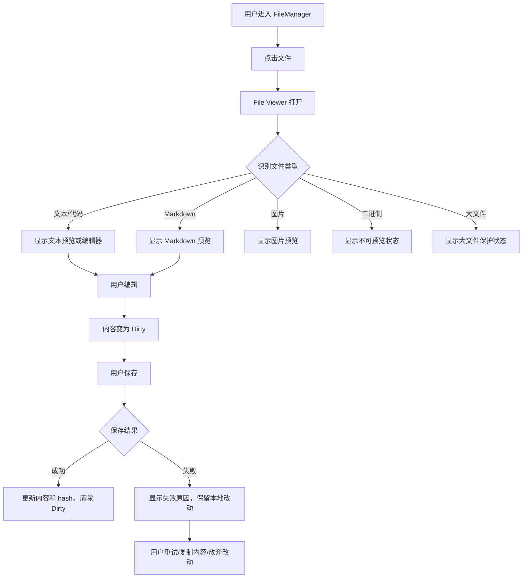
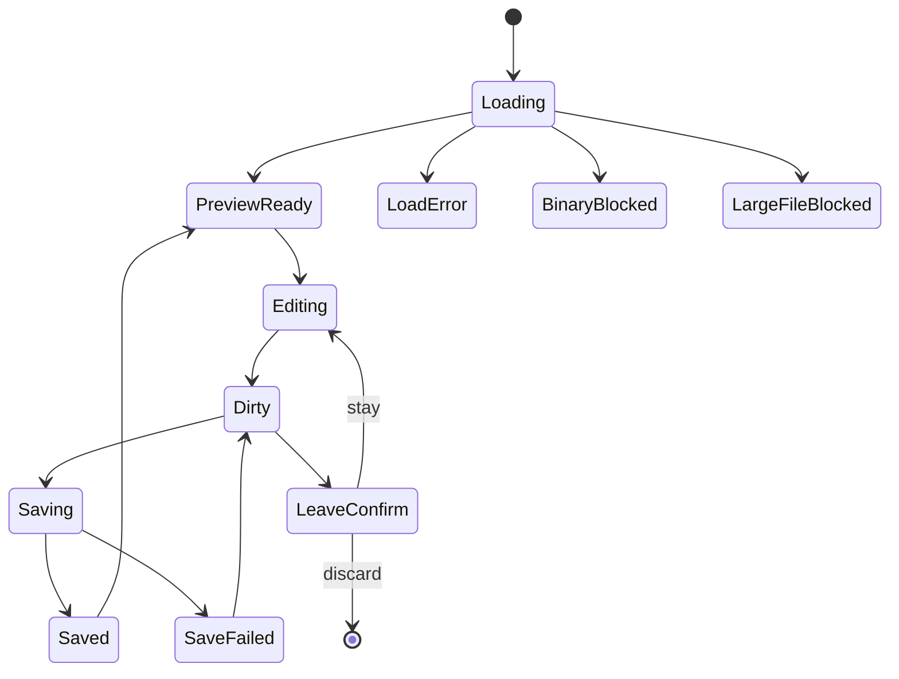

# Phase 6.0 PRD：文件预览 / 编辑闭环

## 0. 版本记录

| 版本 | 日期 | 修订人 | 说明 |
|---|---|---|---|
| v0.1 | 2026-06-06 | zulinliu | 基于 FileManager Phase 5.1 收口结果创建 Phase 6.0 PRD 初稿 |

## 1. 概述

### 1.1 背景介绍

Phase 5 已完成 FileManager 的浏览、CRUD、批量选择、i18n、视觉打磨和发布门禁收口，最终审计分数为 20/20。当前仍存在一个核心体验断点：用户可以在 FileManager 中找到文件，但“打开文件 → 预览 → 编辑 → 保存 → 失败恢复”的闭环还分散在旧 `sessions/file.tsx` 页面和 Git 预览面板中，缺少统一、稳定、移动端友好的文件查看与编辑工作流。

现有代码基础已经具备可复用能力：

- `api.readSessionFile()` / `api.writeSessionFile()` 可读写 session 文件。
- `web/src/routes/sessions/file.tsx` 已有 Markdown 预览、图片预览、文本编辑和 diff 切换雏形。
- `web/src/components/git/GitFilePreview.tsx` 已有响应式预览面板、二进制/图片/Markdown/代码分支处理。
- `web/src/lib/file-utils.ts` 已有图片 MIME、Markdown、二进制判断工具。
- `FileManager` Phase 5.1 已完成中英 i18n 与 CSS 基础清理，适合继续扩展。

### 1.2 产品概述

Phase 6.0 要把文件预览/编辑做成 FileManager 的核心能力：用户从文件列表或路径链接打开文件后，进入统一的 File Viewer/Editor surface。它根据文件类型自动选择预览方式，允许安全编辑文本/代码文件，并在保存失败、文件过大、二进制、只读、未保存离开等关键状态下给出明确反馈。

### 1.3 产品目标

#### 用户目标

- 用户可以在浏览器中快速打开文件，不需要跳转到外部 IDE。
- 用户可以预览文本、代码、Markdown、图片文件。
- 用户可以编辑可编辑文本文件并保存，保存结果明确。
- 用户不会因为误触返回、网络失败或并发写入丢失未保存内容。
- 用户在 iOS 手机上也能完成轻量查看与小改动。

#### 产品目标

- 建立 FileManager 后续上传/下载、移动复制、Git clone、移动端优化之前的统一文件内容基础层。
- 复用并收敛旧 `sessions/file.tsx` 与 `GitFilePreview` 的预览逻辑，减少重复实现。
- 为后续 Monaco/CodeMirror、Markdown 编辑、图片高级查看打好边界清晰的架构基础。

### 1.4 目标用户

| 用户 | 场景 | 频率 | 核心诉求 |
|---|---|---:|---|
| 移动端开发者 | iOS PWA 中快速查看 README、配置、日志、小代码片段 | 高频 | 快速打开、可读、不卡顿、不会误保存 |
| 桌面端开发者 | 浏览器内修改配置、脚本、文档 | 高频 | 编辑和保存可靠，有失败恢复 |
| AI 代理使用者 | 检查代理修改过的文件 | 高频 | 预览准确，能快速回到会话或文件夹 |
| 维护者/管理员 | 远程服务器上查看图片、环境文件、输出文件 | 中频 | 类型识别清楚，敏感/二进制文件不乱渲染 |

### 1.5 名词说明

| 名词 | 说明 |
|---|---|
| File Viewer | 统一文件查看界面，负责加载文件、选择渲染方式、展示状态 |
| File Editor | Viewer 内的编辑模式，允许修改文本内容并保存 |
| Preview Mode | 只读预览模式，Markdown/图片/代码高亮优先 |
| Edit Mode | 可编辑模式，MVP 先使用文本编辑器，后续可替换为 Monaco/CodeMirror |
| Dirty State | 本地内容与服务端最新内容不同，存在未保存改动 |
| Large File | 超过阈值的文件，默认只读或提示用户确认加载 |
| Binary File | 无法安全按文本解码的文件，展示不可编辑/不可预览状态，图片除外 |
| Conflict | 保存前文件在远端发生变化，或 expectedHash 不匹配 |

### 1.6 角色及权限

| 角色 | 权限 |
|---|---|
| 有 session 访问权限的用户 | 可读取 session 工作目录内文件 |
| 远程控制 session 用户 | 可编辑、保存、创建文件内容 |
| 本地/只读状态 session 用户 | 默认只读，编辑入口禁用并说明原因 |

**[假设]** 当前 Phase 6.0 不新增独立权限系统，沿用 session 权限、路径安全和 Hub→CLI RPC 校验。

## 2. 产品描述

### 2.1 需求范围

#### In Scope

1. 从 FileManager 文件行打开文件查看界面。
2. 文本/代码文件预览与编辑。
3. Markdown 文件默认预览，可切换编辑。
4. 图片文件预览。
5. 二进制文件不可编辑状态。
6. 大文件保护。
7. 保存成功、保存失败、重试、恢复状态。
8. 未保存离开确认。
9. i18n 中英文案。
10. 复用或抽取共享文件预览工具与组件。

#### Out of Scope

1. Monaco/CodeMirror 深度编辑能力（语法补全、多光标、格式化）作为后续增强，不阻塞 MVP。
2. PDF、音视频、压缩包预览。
3. 实时协同编辑。
4. Git merge conflict 可视化解决器。
5. 目录上传/批量下载。
6. 文件权限 chmod/chown。

### 2.2 用户主流程

### 2.3 状态转换

### 2.4 功能清单

| 模块 | 功能 | 优先级 | 说明 |
|---|---|---:|---|
| Entry | FileManager 点击文件打开 Viewer | P0 | 替换或接入现有 `/sessions/$sessionId/file` 路由 |
| Loader | 文件内容加载 | P0 | `readSessionFile` + React Query |
| Type Detection | 类型判断 | P0 | 文本/Markdown/图片/二进制/大文件 |
| Text Preview | 文本/代码只读预览 | P0 | MVP 可用 `<pre>`/CodeBlock，后续 Monaco |
| Text Edit | 文本编辑 | P0 | MVP textarea 或现有编辑区，必须可靠保存 |
| Save | 保存与反馈 | P0 | 成功、失败、重试、保留本地 dirty |
| Leave Guard | 未保存离开确认 | P0 | 路由离开、返回、关闭模式切换 |
| Markdown | Markdown 预览/编辑切换 | P1 | 默认预览 |
| Image | 图片预览 | P1 | 复用 `ImagePreview` |
| Large File | 大文件保护 | P1 | 阈值 + 只读/确认加载 |
| i18n | 中英双语 | P0 | locale parity |
| Tests | 单测/集成测试 | P0 | 文件类型、dirty、保存失败、离开确认 |

## 3. 功能需求

### 3.1 文件打开入口

**用户故事**：作为开发者，我希望点击 FileManager 中的文件即可打开预览/编辑界面，以便快速查看或修改文件。

**前置条件**：

- sessionId 存在且用户有权限访问。
- 文件路径来自 FileManager listing 或已编码 URL search param。

**交互要求**：

- 单击文件行主按钮打开 Viewer。
- 目录仍进入目录浏览，不触发 Viewer。
- 新文件创建后可直接打开 Viewer。
- 文件路径在 URL 中可恢复，刷新后仍打开同一文件。

**异常流程**：

| 场景 | 处理 |
|---|---|
| path 缺失 | 展示“缺少文件路径”状态 |
| session inactive | 展示只读/不可用说明 |
| read RPC 失败 | 展示错误 + Retry |
| 文件不存在 | 展示“文件不存在或已删除” |

### 3.2 文件加载与类型识别

**用户故事**：作为用户，我希望系统自动判断文件类型，以便用合适方式查看内容。

**规则**：

| 类型 | 判断 | 默认展示 |
|---|---|---|
| 图片 | 扩展名映射到 `IMAGE_MIME_BY_EXTENSION` | 图片预览 |
| Markdown | `.md` / `.mdx` / `.markdown` | Markdown 预览 |
| 文本/代码 | base64 可 UTF-8 解码且非 binary | 文本/代码预览，支持编辑 |
| 二进制 | UTF-8 解码失败或控制字符比例过高 | 不可预览/可下载 |
| 大文件 | [假设] base64 解码后 > 1MB 文本 | 默认只读或确认加载 |

**数据字段**：

| 字段 | 类型 | 必填 | 说明 |
|---|---|---|---|
| sessionId | string | 是 | 当前 session |
| path | string | 是 | session 工作目录内相对路径或既有 API 支持路径 |
| content | string | 是 | base64 内容 |
| hash | string | [待确认] | 建议 readFile 返回 sha256，用于保存冲突检测 |
| size | number | [待确认] | 建议 readFile 返回字节数，用于大文件判断 |

### 3.3 文本/代码预览

**用户故事**：作为开发者，我希望打开代码文件时先快速看到内容，以便确认是否需要编辑。

**MVP 要求**：

- 显示文件路径、文件名、类型、大小信息。
- 展示文本内容，保留换行和缩进。
- 长文件不应冻结页面。
- 支持复制内容。
- 默认不自动进入编辑，避免移动端误触。

**建议复用**：`CodeBlock`、`langAlias`、`file-utils`。

### 3.4 文本编辑与保存

**用户故事**：作为开发者，我希望修改文本文件并保存，以便完成远程轻量编辑。

**交互要求**：

- 用户点击“Edit”进入编辑模式。
- 编辑后出现 Dirty 标记和 Save / Discard actions。
- 保存期间 Save 按钮 loading + 禁止重复提交。
- 保存成功后更新 React Query cache，清除 Dirty 标记。
- 保存失败后保留本地内容，不覆盖用户输入。
- 保存失败必须给出可复制/可重试路径。

**保存策略**：

- MVP 可以继续使用 `forceOverwrite: true`，但 PRD 建议 Phase 6.0 引入 hash 冲突检测。
- [假设] 第一垂直切片先保证“失败不丢内容”，冲突检测可作为同阶段第二任务。

**异常流程**：

| 场景 | 提示 | 恢复动作 |
|---|---|---|
| 网络失败 | 保存失败，网络或代理不可用 | Retry、Copy content |
| 权限不足 | 当前 session 不允许写入 | 保留内容、只读切换 |
| 文件已变化 | 文件在远端已更新 | Reload remote、Overwrite、Copy mine |
| 写入超限 | 文件过大或超过 API 限制 | Copy content、下载本地副本 |

### 3.5 Markdown 预览/编辑

**用户故事**：作为开发者，我希望 Markdown 默认以渲染形式打开，并能切换到编辑，以便查看 README 或快速修改文档。

**要求**：

- Markdown 文件默认进入 Preview mode。
- 顶部 segmented control：Preview / Edit。
- Preview 使用 `MarkdownFilePreview`，不允许 raw HTML 注入。
- Edit 后 Dirty/save 规则与文本一致。

### 3.6 图片预览

**用户故事**：作为用户，我希望打开图片文件时直接看到图片，以便检查截图、图标或设计资产。

**要求**：

- 图片文件默认使用 `ImagePreview`。
- 展示文件名和路径。
- 提供下载/复制路径。
- 图片不可编辑。
- 图片加载失败显示错误和下载入口。

### 3.7 二进制和大文件保护

**用户故事**：作为用户，我希望系统不要尝试把二进制或超大文件当文本打开，以免页面卡死或乱码。

**要求**：

- 二进制：显示“此文件无法作为文本预览”，提供下载/复制路径。
- 图片二进制例外，用图片预览。
- 大文本文件：显示大小提示，默认只读，用户确认后才加载完整编辑。
- [假设] MVP 阈值：文本编辑 1MB，预览 2MB，超过 5MB 不通过现有 write API。

### 3.8 未保存离开确认

**用户故事**：作为用户，我希望离开有未保存改动的文件前得到提醒，以免丢失修改。

**触发条件**：

- Dirty 状态下点击返回、切换文件、切换目录、关闭 Viewer、浏览器刷新或路由离开。

**交互要求**：

- 弹窗文案说明文件名和未保存风险。
- 选项：Stay / Discard changes。
- [建议] Save and leave 可作为 P1，MVP 先做 Stay/Discard。

### 3.9 i18n 与可访问性

**i18n 要求**：

- 所有新增文案进入 `en.ts` / `zh-CN.ts`。
- key 前缀建议：`file.viewer.*`。
- locale parity 必须通过。

**A11y 要求**：

- Viewer 有明确 landmark 或 dialog/region label。
- Save、Discard、Retry、Copy、Download 都有可访问名称。
- Dirty 状态通过 aria-live 或 status 可被读屏感知。
- 移动端触控目标 ≥44px。
- 键盘可完成打开、编辑、保存、关闭。

## 4. 非功能需求

### 4.1 安全

- 文件路径必须继续走现有 Hub/CLI path validation，不在前端拼接越权路径。
- Markdown 不允许 raw HTML 注入。
- 文件内容按文本渲染时必须转义，禁止 `dangerouslySetInnerHTML` 渲染用户文件内容。
- 保存接口 body size 受限，错误要可恢复。

### 4.2 性能

| 指标 | 建议目标 |
|---|---|
| 小文件打开 | < 500ms 显示内容或 skeleton |
| 1MB 文本渲染 | 不阻塞主线程超过可感知阈值 |
| 大文件 | 默认保护，不自动加载编辑器 |
| Monaco/高亮依赖 | 路由级或交互后懒加载 |

### 4.3 埋点/观测

[待确认] 当前项目未统一产品埋点。建议先记录为可选日志事件，不阻塞实现。

| 事件 | 参数 | 时机 |
|---|---|---|
| file_viewer_open | fileType, sizeBucket, source | 打开文件 |
| file_viewer_save | result, fileType, sizeBucket | 保存结束 |
| file_viewer_error | stage, errorCode | 加载/保存失败 |
| file_viewer_leave_dirty | action | Dirty 离开确认 |

### 4.4 系统集成

- Web：FileManager row → Viewer route/panel。
- Hub：复用 `/api/sessions/:id/file` GET/PUT。
- CLI：复用 `ReadFile` / `WriteFile` RPC。
- Shared：如需 hash/size 扩展，更新 `FileReadResponse` 类型。

## 5. 验收标准

### 5.1 MVP 验收

- [ ] 从 FileManager 点击文本文件可打开 Viewer。
- [ ] 文本文件内容可加载、编辑、保存。
- [ ] 保存失败时本地改动不丢失，并显示 Retry。
- [ ] Markdown 默认预览，可切换编辑并保存。
- [ ] 图片文件显示图片预览，不出现乱码文本。
- [ ] 二进制文件显示不可预览状态。
- [ ] 大文件触发保护状态，不直接进入可编辑 textarea。
- [ ] Dirty 状态离开会确认。
- [ ] 中英 locale parity 通过。
- [ ] `bun run typecheck`、目标测试、`bun run build:web` 通过。

### 5.2 测试要点

| 测试 | 期望 |
|---|---|
| 空文本文件 | 正常显示空状态，可编辑保存 |
| 超长文件名 | header 不溢出，可复制路径 |
| 1MB 附近文本 | 有大文件状态或可接受性能 |
| PNG/JPG/SVG | 图片预览 |
| `.md` | 默认 Markdown 预览 |
| `.env` / dotfile | 文本预览，不特殊泄露到日志 |
| 保存 500 错误 | Dirty 内容保留 |
| 路由离开 | Dirty guard 生效 |
| iOS 390px | 操作按钮不小于 44px，无横向溢出 |

## 6. 待确认项清单

### 必须确认（实现前建议确认）

1. **[假设]** Phase 6.0 MVP 先使用现有 textarea/CodeBlock，不立即接 Monaco 深度编辑。
2. **[假设]** 文本编辑阈值为 1MB，大于 1MB 默认只读或确认加载。
3. **[待确认]** `ReadFile` 是否要返回 hash/size/mtime，用于冲突检测和大文件状态。

### 建议确认（影响体验但不阻塞 MVP）

4. **[待确认]** Dirty 离开弹窗是否需要 “Save and leave”。
5. **[待确认]** 是否需要对 `.env` 等敏感文件增加明显提示。
6. **[待确认]** 是否要求保存后自动触发 Git status refresh。

### 可后续补充

7. PDF/音视频/压缩包预览。
8. Monaco/CodeMirror 深度编辑。
9. 文件历史版本和冲突可视化解决。
