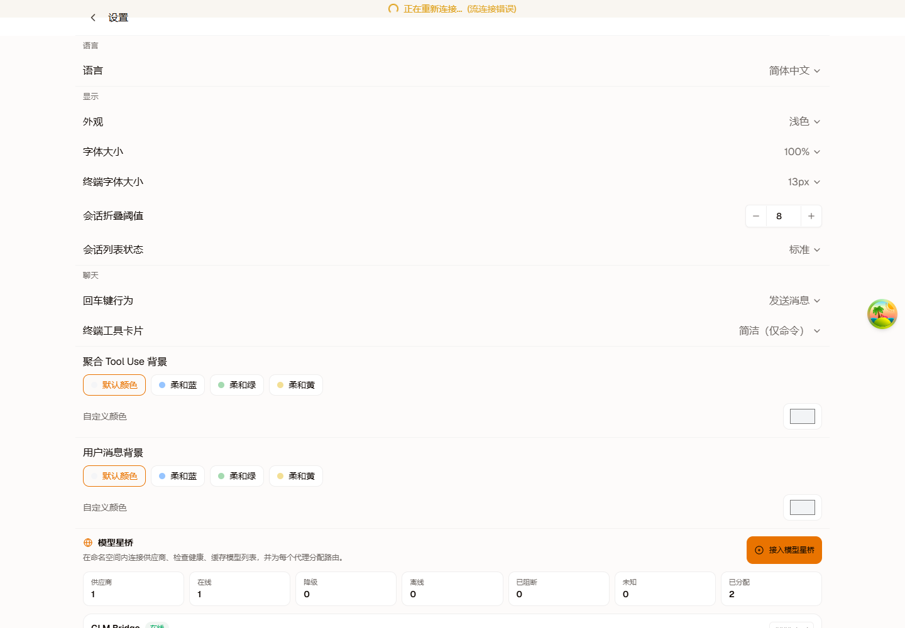
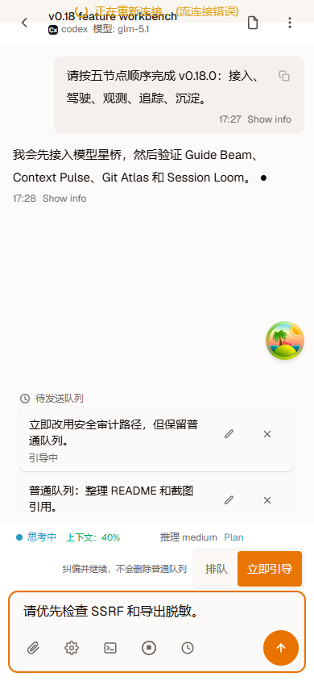
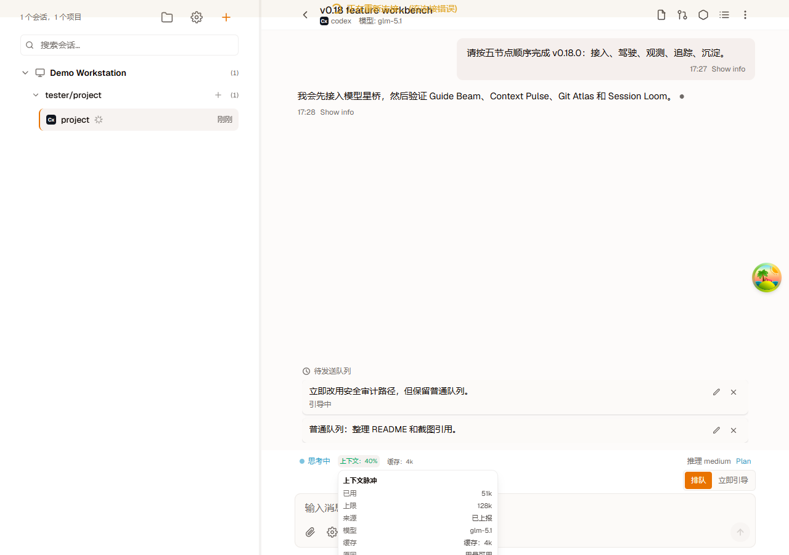
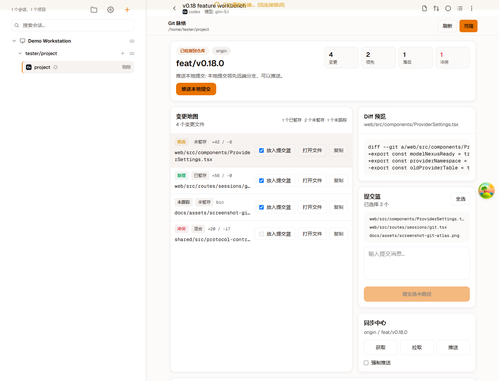
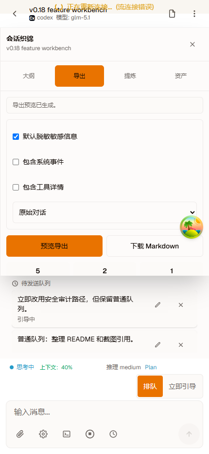

[English](./README.md) | [中文](./README.zh-CN.md)

<p align="center">
  
</p>

<p align="center">
  <strong>随时AI，编程自在 — One workbench for every AI coding agent.</strong>
</p>

<p align="center">
  
  
  
</p>

<p align="center">
  <a href="#why-hapi-power">Why</a> ·
  <a href="#the-hapi-power-loop">Loop</a> ·
  <a href="#v0180-five-modules">v0.18</a> ·
  <a href="#features">Features</a> ·
  <a href="#install">Install</a> ·
  <a href="#quick-start">Quick Start</a> ·
  <a href="#architecture">Architecture</a> ·
  <a href="./CHANGELOG.md">Changelog</a>
</p>

---

## Why Hapi Power?

Most AI coding tools lock you into one agent, one terminal, one machine. Hapi Power gives you a unified workbench where you can switch between Claude Code, Codex, Gemini, and more — anytime, anywhere, on any device.

Hapi Power turns agent chats into a controllable engineering loop: connect trusted models, steer agents while they run, watch context risk, trace every code change, and preserve the session as project memory.

**Code on your phone.** Review AI agent changes with a swipe, monitor terminal output, and approve or reject file edits — all from your phone. No laptop needed.

**A complete development toolkit in the browser.** Model Nexus, Guide Beam, Context Pulse, Git Atlas, Session Loom, full file operations, Monaco code editor, and terminal access. Everything you need to code with AI agents, in one place.

**Deploy anywhere in seconds.** Single binary, zero dependencies. Self-host on any server, or run locally with one command.

---

## The Hapi Power Loop

1. **Connect**: Model Nexus connects trusted model providers, checks health and capabilities, and routes each agent to the right model.
2. **Drive**: Guide Beam lets you correct course while an agent is still working, without dropping the normal message queue.
3. **Observe**: Context Pulse shows reliability risk at a glance with `Context: 40%` and clear diagnostics when usage is unavailable.
4. **Trace**: Git Atlas maps branch state, agent changes, diffs, commit basket, and remote sync risk in one Git workspace.
5. **Preserve**: Session Loom turns conversations into Markdown exports, decision records, drift checks, and reusable project memory.

---

## v0.18.0 Five Modules

v0.18.0 is organized around five product modules. Each module has a clear entry point, a concrete output, and a safe fallback when the connected agent or provider cannot support the advanced path.

| Step | Module | Entry | What it does |
|------|--------|-------|--------------|
| Connect | **Model Nexus** | Settings -> Model Nexus | Adds provider governance, health checks, model discovery, capability cache, encrypted keys, and default agent route assignment. |
| Drive | **Guide Beam** | Session composer while the agent is thinking | Sends urgent corrections as isolated guide messages when supported, otherwise falls back to the normal queue without dropping text. |
| Observe | **Context Pulse** | Session status bar | Shows `Context: n%`, token/cache details, source diagnostics, and unavailable reasons instead of a silent zero or vague token string. |
| Trace | **Git Atlas** | Session -> Git | Combines branch state, change map, diff preview, commit basket, sync center, and dangerous-operation confirmations in one Git page. |
| Preserve | **Session Loom** | Session -> Loom | Builds server-side outlines, Markdown exports, background design synthesis, and downloadable session assets. |

Session Loom has two separate output paths: **Export** creates deterministic Markdown from stored conversation history, while **Synthesis** calls the current session agent's configured provider API model in the background to produce a reusable Design Plan Markdown file. Synthesis does not insert a message into the active chat.

See [v0.18.0 Five Modules](./docs/v0.18-five-modules.md) for detailed behavior, safety boundaries, and implementation references.

---

## Screenshots

<p align="center">
  
</p>

<table align="center">
  <tr>
    <td align="center"><b>Session List</b></td>
    <td align="center"><b>Create Session — Pick Your Agent</b></td>
  </tr>
  <tr>
    <td></td>
    <td></td>
  </tr>
  <tr>
    <td align="center"><b>Settings & Model Nexus</b></td>
    <td align="center"><b>Dark Mode</b></td>
  </tr>
  <tr>
    <td></td>
    <td></td>
  </tr>
</table>

<p align="center">
  
  &nbsp;&nbsp;
  
</p>

<table align="center">
  <tr>
    <td align="center"><b>Connect: Model Nexus</b></td>
    <td align="center"><b>Drive: Guide Beam</b></td>
  </tr>
  <tr>
    <td></td>
    <td></td>
  </tr>
  <tr>
    <td align="center"><b>Observe: Context Pulse</b></td>
    <td align="center"><b>Trace: Git Atlas</b></td>
  </tr>
  <tr>
    <td></td>
    <td></td>
  </tr>
</table>

<p align="center">
  <b>Preserve: Session Loom</b><br>
  
</p>

---

## Features

**Model Nexus** — Connect Anthropic, OpenAI, Gemini, and custom-compatible providers. Detect models, latency, usage support, and context limits, then assign default model routes per agent.

**Guide Beam** — While an agent is working, new messages queue by default. Switch to Guide now to send a correction immediately without losing the conversation or pending queue.

**Context Pulse** — Replace noisy token strings with a clear `Context: 40%` signal, threshold colors, source details, and unavailable-state explanations.

**Git Atlas** — See branch state, agent changes, diffs, commit basket, and remote sync risk in one Git map. Review, commit, and sync from desktop or iOS PWA.

**Session Loom** — Turn the Outline panel into a standalone conversation asset workbench. Export deterministic Markdown transcripts, filter noise, and run background design synthesis through the current session agent's provider route.

**Mobile-First PWA** — Responsive mobile UI with tap and long-press gestures for change review, read-only terminal, and iOS-optimized PWA experience. Review and approve AI agent changes from your phone, anytime, anywhere.

**Single Binary Deploy** — Build a self-contained executable with embedded web assets. One file, full platform, zero dependencies. Deploy on any server in seconds.

<details>
<summary><strong>See all features</strong></summary>

### AI Workflow

**Guide Beam** — Composer delivery modes distinguish normal queued messages from immediate guidance. Unsupported or older agents fall back to the queue instead of losing the message.

**Context Pulse** — Real-time context usage uses the consumed percentage, not remaining tokens. Popovers show source, used/max, model, cache details, and unavailable reasons.

**Session Loom** — Server-side outlines and exports read the full session history, apply secret redaction by default, and provide copy, download, and share fallbacks.
Export is deterministic Markdown generation; synthesis is a separate background model call that produces a Design Plan Markdown asset without interrupting the active conversation.

### Platform

**Model Nexus** — Configure third-party API endpoints, auto-discover models via safe health checks, cache capabilities, and bind providers per session or agent type. AES-256-GCM encrypted key storage.

**Git Atlas** — Structured Git dashboard, diff preview, commit basket, sync center, selected-path commits, and server-side confirmation for dangerous operations.

**File Management** — Browse directory trees, create, rename, move, copy, upload, download, search, and edit files with Monaco in the browser.

**Permission Modes** — Each agent supports its own permission modes. Claude: default, acceptEdits, bypassPermissions, plan. Codex/Gemini/Kimi: default, read-only, safe-yolo, yolo. Cursor: default, plan, ask, yolo. OpenCode: default, plan, yolo.

**Mobile-First PWA** — Responsive mobile UI with tap and long-press gestures for change review, read-only terminal, iOS-optimized install guidance, and offline support via service worker.

**Encrypted Relay** — Secure tunnel for remote CLI-to-Hub connections. Connect with `hub --relay` — no manual configuration needed.

**Single Binary Deploy** — Self-contained executable with embedded web assets. Cross-platform builds for macOS (ARM/x64), Linux (ARM/x64), and Windows.

**i18n** — Full Chinese and English interface. Switch languages in settings.

### Chat

**Rich Message Rendering** — GitHub Flavored Markdown, Mermaid diagrams, KaTeX math formulas, and syntax-highlighted code blocks via Shiki.

**Image Paste & Drop** — Paste or drag images directly into chat. Images go directly to the AI agent for visual analysis and code generation.

**Slash Command Autocomplete** — Agent-specific built-in commands (`/compact`, `/clear`, `/plan`, `/stats`, etc.) with inline autocomplete.

**Skill & Plugin Management** — Browse and search the skills.sh marketplace, install and uninstall skills per session. Manage plugins with install and uninstall support. Extend your AI agents without leaving the browser.

</details>

---

## Install

### Download Binary (Recommended)

Download the latest release for your platform from [GitHub Releases](https://github.com/zulinliu/make-hapi-power-again/releases).

### Homebrew (macOS / Linux) — Coming Soon

<!-- ```bash
brew tap zulinliu/hapi-power
brew install hapi-power
``` -->

### Build from Source

Prerequisites: [Bun](https://bun.sh) >= 1.0, Node.js >= 18

```bash
git clone https://github.com/zulinliu/make-hapi-power-again.git
cd make-hapi-power-again
bun install
```

---

## Quick Start

### 1. Start the Hub

```bash
bun run dev
```

Hub API at `http://localhost:3016`, Web UI at `http://localhost:5173` (Vite dev server).

### 2. Connect an AI Agent

```bash
# Claude Code (default)
hapi-power claude

# OpenAI Codex
hapi-power codex

# Google Gemini
hapi-power gemini

# Start hub with E2E encrypted relay
hapi-power hub --relay
```

### 3. Open in Browser

Visit `http://localhost:5173` on your desktop, or open it on your phone for coding on mobile. In production (single binary), Web UI is served directly by Hub at port `3016`.

### 4. Build Single Binary

```bash
bun run build:single-exe
```

---

## Usage

### CLI Commands

| Command | Description |
|---------|-------------|
| *(default)* | Connect to Hub with Claude Code |
| `codex` | Start Codex mode |
| `gemini` | Start Gemini mode |
| `cursor` | Start Cursor Agent mode |
| `opencode` | Start OpenCode mode |
| `kimi` | Start Kimi mode |
| `hub` / `server` | Start Hub server |
| `hub --relay` | Start Hub with encrypted relay |
| `runner start` | Start background Runner daemon |
| `resume` | Resume a previous session |
| `doctor` | Run diagnostics |
| `mcp` | MCP server management |
| `auth` | Manage authentication |

### Environment Variables

**Hub:**

| Variable | Description | Default |
|----------|-------------|---------|
| `HAPI_POWER_LISTEN_PORT` | Hub listen port | `3016` |
| `HAPI_POWER_LISTEN_HOST` | Hub listen host | `127.0.0.1` |
| `CLI_API_TOKEN` | Shared secret for CLI and Web authentication | auto-generated |
| `HAPI_POWER_HOME` | Data storage directory | `~/.hapi-power` |
| `CORS_ORIGINS` | CORS allowed origins (comma-separated) | — |
| `HAPI_POWER_PUBLIC_URL` | Public URL for external access | `http://localhost:{port}` |
| `TELEGRAM_BOT_TOKEN` | Telegram Bot API token for auth | — |
| `VAPID_SUBJECT` | Contact info for Web Push (email or URL) | `mailto:admin@YOUR_DOMAIN` |
| `HAPI_POWER_RELAY_API` | Relay API domain for encrypted tunnel | `YOUR_RELAY_DOMAIN` |
| `HAPI_POWER_RELAY_AUTH` | Relay authentication key | — |

**CLI:**

| Variable | Description | Default |
|----------|-------------|---------|
| `HAPI_POWER_API_URL` | Hub address | `http://localhost:3016` |
| `CLI_API_TOKEN` | CLI authentication token | auto-generated |
| `HAPI_POWER_HOME` | Data storage directory | `~/.hapi-power` |
| `ANTHROPIC_API_KEY` | Claude API key | — |
| `OPENAI_API_KEY` | OpenAI API key (for Codex, Whisper) | — |

### Model Nexus

Configure third-party API providers in Settings → Model Nexus:

1. Add a provider with namespace, protocol, base URL, and API key
2. Run health and capability detection to discover models, usage support, context limits, and latency
3. Assign the provider and default model to an agent type (Claude, Codex, Gemini, etc.)
4. Select the provider route when creating or controlling a session

API keys are encrypted with AES-256-GCM and never stored in plaintext.

---

## Architecture

```
┌─────────┐  Socket.IO(/cli)  ┌──────────────────┐  REST/SSE  ┌─────────┐
│   CLI   │ ────────────────  │       Hub        │ ────────── │   Web   │
│ (Agent) │                   │ (Hono + Socket.IO)│  Socket.IO │ (React) │
└─────────┘                   └──────────────────┘            └─────────┘
    │                               │       │                       │
    ├─ Agent wrappers               ├─ SQLite persistence          ├─ TanStack Router
    │  (Claude/Codex/Gemini/        ├─ Session cache               ├─ TanStack Query
    │   OpenCode/Cursor/Kimi)       ├─ RPC Gateway                 ├─ Monaco Editor
    ├─ Socket.IO client             ├─ Push notifications          ├─ xterm.js
    └─ RPC handlers                 └─ EventPublisher             └─ Socket.IO client
```

Three-layer monorepo connected via Socket.IO and REST/SSE:

1. **CLI** starts an AI agent process and connects to Hub via Socket.IO `/cli` namespace
2. **Hub** persists data to SQLite, broadcasts events via SSE, and routes RPC calls
3. **Web** subscribes to SSE for real-time updates, uses Socket.IO for terminal and binary transfer, and sends user actions to Hub REST API

---

## Tech Stack

| Layer | Technology |
|-------|-----------|
| Runtime | [Bun](https://bun.sh) |
| Backend | [Hono](https://hono.dev) + Socket.IO + bun:sqlite |
| Frontend | [React 19](https://react.dev) + TanStack Router + TanStack Query + Tailwind CSS |
| Code Editor | Monaco Editor + Shiki |
| Terminal | xterm.js + Bun.Subprocess |
| Git | system `git` CLI via RPC |
| Validation | Zod |
| Build | Vite + Bun |
| Realtime | Socket.IO + SSE |

---

## Documentation

- [CLI Reference](./cli/README.md) — commands, configuration, agent setup
- [Hub API Reference](./hub/README.md) — REST endpoints, Socket.IO events
- [Web Architecture](./web/README.md) — routes, components, data flow
- [v0.18.0 Five Modules](./docs/v0.18-five-modules.md) — Model Nexus, Guide Beam, Context Pulse, Git Atlas, and Session Loom
- [AGENTS.md](./AGENTS.md) — development guide for contributors and AI agents

---

## Contributing

Contributions are welcome! See [CONTRIBUTING.md](./CONTRIBUTING.md) for guidelines.

By contributing, you agree that your code will be licensed under AGPL-3.0 and you have the right to submit it under that license.

---

## License

Hapi Power is licensed under [AGPL-3.0](./LICENSE). What this means:

- **Free to use** — self-host, modify, and run for any purpose
- **Your code is yours** — your own project's code is not affected by this license; using Hapi Power to build your projects does not change your project's license
- **Share changes** — if you modify Hapi Power and offer it as a network service, you must share your modifications under the same license

---

## Acknowledgments

Hapi Power is a modified version of [hapi](https://github.com/nicepkg/hapi) by the nicepkg team. Their work on the agent communication protocol and web UI provided the foundation for this project.

The CLI module includes code derived from [happy-cli](https://github.com/slopus/happy-cli) by Kirill Dubovitskiy, licensed under the MIT License.
