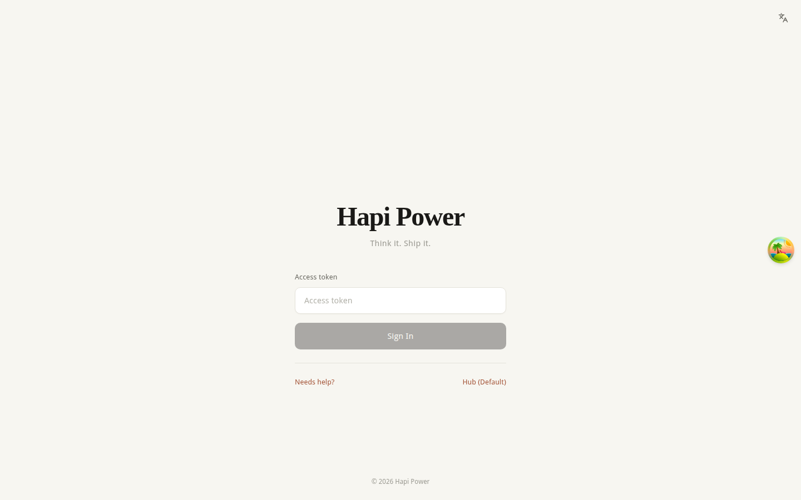
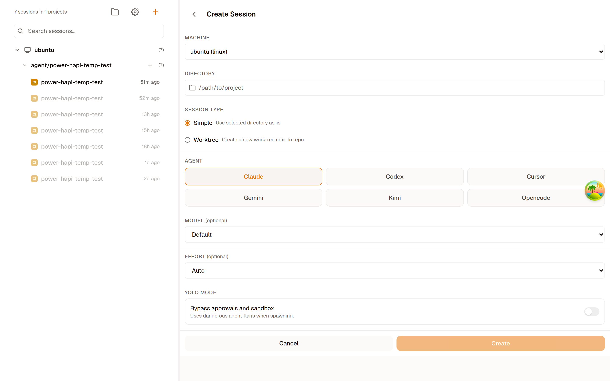
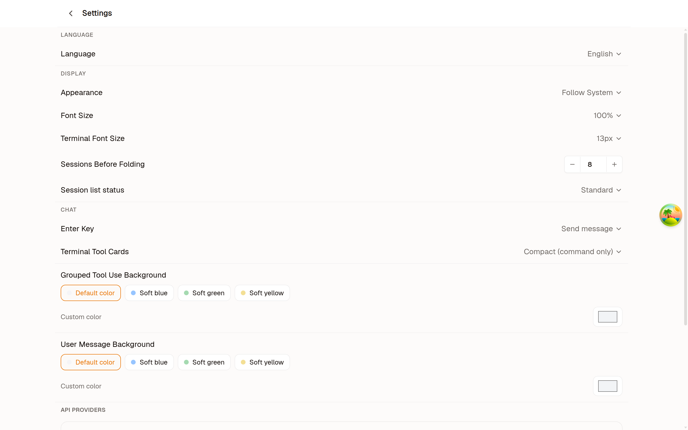
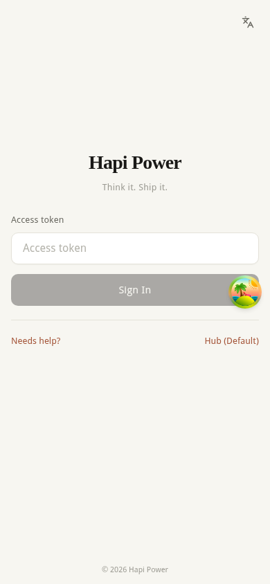
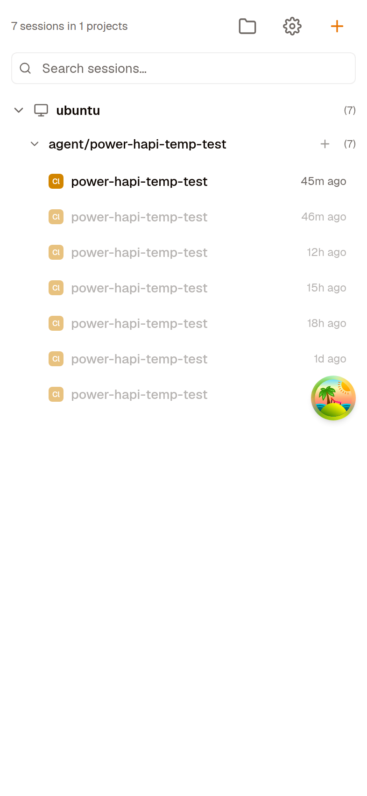

[English](./README.md) | [中文](./README.zh-CN.md)

<p align="center">
  
</p>

<p align="center">
  <strong>随时AI，编程自在 — 一个工作台，驾驭所有 AI 编程 Agent。</strong>
</p>

<p align="center">
  
  
  
</p>

<p align="center">
  <a href="#为什么选择-hapi-power">为什么</a> ·
  <a href="#功能特色">功能</a> ·
  <a href="#安装">安装</a> ·
  <a href="#快速开始">快速开始</a> ·
  <a href="#架构">架构</a> ·
  <a href="./CHANGELOG.md">更新日志</a>
</p>

---

## 为什么选择 Hapi Power?

大多数 AI 编码工具把你锁定在一个代理、一个终端、一台机器上。Hapi Power 提供统一工作台，让你在 Claude Code、Codex、Gemini 等代理间自由切换——随时随地，任意设备。

**在手机上编程。** 滑动屏幕审批 AI 代理的代码变更，监控终端输出，通过或驳回文件编辑——全部在手机上完成，无需电脑。

**浏览器中的完整开发套件。** 可视化 Git 管理、全功能文件操作、Monaco 代码编辑器、自定义模型 Provider 支持（API 密钥加密存储）。与 AI 代理协作编码所需的一切，一个地方搞定。

**秒级部署到任意服务器。** 单文件、零依赖。自建部署到任何服务器，或一条命令本地运行。

---

## 截图

<p align="center">
  
</p>

<table align="center">
  <tr>
    <td align="center"><b>会话列表</b></td>
    <td align="center"><b>新建会话 — 选择 AI 代理</b></td>
  </tr>
  <tr>
    <td></td>
    <td></td>
  </tr>
  <tr>
    <td align="center"><b>设置与模型供应商</b></td>
    <td align="center"><b>暗色模式</b></td>
  </tr>
  <tr>
    <td></td>
    <td></td>
  </tr>
</table>

<p align="center">
  
  &nbsp;&nbsp;
  
</p>

---

## 功能特色

**多代理统一编排** — Claude Code、OpenAI Codex、Google Gemini、Cursor Agent、OpenCode、Kimi 并行运行。按会话切换代理，每个代理支持独立权限模式——从只读到全自动，灵活掌控。

**变更审查与精细撤销** — AI 代理的每次文件变更按对话轮次分组展示。逐文件查看 Diff，支持单个或批量通过/驳回。支持会话、步骤、文件三种粒度回滚，并提供影响预览。

**可视化 Git + 文件管理** — 在浏览器中完成 commit、diff、分支管理、push、pull、clone。浏览目录树，新建、重命名、移动、复制、上传、下载、搜索文件——全部通过上下文菜单操作。

**自定义模型 Provider** — 配置第三方 API 端点，自动发现可用模型，按会话绑定 Provider。API 密钥以 AES-256-GCM 加密存储。

**移动端优先 PWA** — 专属移动端路由、滑动手势审批变更、只读终端、针对 iOS 深度优化 PWA 体验。随时随地用手机审批 AI 代理的代码变更。

**单文件部署** — 构建产物为内嵌 Web 资源的自包含可执行文件——一个文件即完整平台，零外部依赖，秒级部署到任意服务器。

<details>
<summary><strong>查看完整功能列表</strong></summary>

### AI 工作流

**变更审查** — AI 代理的文件变更按对话轮次分组展示。逐文件查看 Diff，支持单个或批量通过/驳回。上下文 Token 用量条实时显示代理的上下文消耗状态（正常、警告、临界）。

**精细撤销** — 支持会话、步骤、文件三种粒度的回滚操作，并提供影响预览——执行前可确认将还原哪些文件。完整快照历史，确保回滚安全可靠。

**上下文用量监控** — 实时 Token 用量进度条，颜色状态提示（正常、警告、临界）帮助判断何时需要压缩上下文或开启新会话。

### 平台特色

**自定义模型 Provider** — 配置第三方 API 端点，通过 `/v1/models` 自动发现可用模型，按会话或代理类型绑定 Provider。API 密钥以 AES-256-GCM 加密存储。

**权限模式** — 每种代理支持独立的权限模式，实现细粒度操作控制。例如 Claude 支持 default、acceptEdits、bypassPermissions、plan 四种模式；Codex 支持 default、read-only、safe-yolo、yolo 模式。

**移动端优先 PWA** — 专属 `/m/*` 路由，滑动手势审批变更，只读终端，针对 iOS 深度优化 PWA 体验，支持安装引导和离线访问。

**端到端加密中继** — 基于 WireGuard 的安全隧道，CLI 通过 `--relay` 单一参数即可连接 Hub，实现零配置安全远程访问。

**单文件部署** — 构建产物为内嵌 Web 资源的自包含可执行文件，支持 macOS（ARM/x64）、Linux（ARM/x64）、Windows 跨平台构建。

**国际化** — 完整中英文界面支持，在设置中一键切换语言。

### 聊天体验

**富消息渲染** — 完整 Markdown 渲染，支持 GitHub Flavored Markdown、Mermaid 图表、KaTeX 数学公式、Shiki 代码语法高亮。

**图片粘贴与拖拽** — 直接粘贴或拖拽图片到聊天，AI 代理将接收图片进行视觉分析和代码生成。

**Slash 命令自动补全** — 每种代理的内置命令（`/compact`、`/clear`、`/plan`、`/stats` 等）支持内联自动补全。

**Skill 与插件管理** — 浏览和搜索 skills.sh 市场，按会话安装或卸载 Skill。管理插件——一切在浏览器中完成，轻松扩展 AI 代理的能力。

</details>

---

## 安装

### 下载可执行文件（推荐）

从 [GitHub Releases](https://github.com/zulinliu/make-hapi-power-again/releases) 下载最新版本。

### Homebrew（macOS / Linux）

```bash
brew tap zulinliu/hapi-power
brew install hapi-power
```

### 从源码构建

前置条件：[Bun](https://bun.sh) >= 1.0，Node.js >= 18

```bash
git clone https://github.com/zulinliu/make-hapi-power-again.git
cd make-hapi-power-again
bun install
```

---

## 快速开始

### 1. 启动 Hub

```bash
bun run dev
```

Hub 监听 `http://localhost:3016`，Web UI 监听 `http://localhost:5173`。

### 2. 连接 AI 代理

```bash
# Claude Code（默认）
hapi-power claude

# OpenAI Codex
hapi-power codex

# Google Gemini
hapi-power gemini

# 启动 E2E 加密中继 Hub
hapi-power hub --relay
```

### 3. 打开浏览器

桌面端访问 `http://localhost:5173`，或在手机上打开同一地址，随时随地编程。

### 4. 构建单文件可执行程序

```bash
bun run build:single-exe
```

---

## 使用说明

### CLI 命令

| 命令 | 说明 |
|------|------|
| `start hub` | 使用 Claude Code 连接到 Hub |
| `start codex` | 启动 Codex 模式 |
| `start gemini` | 启动 Gemini 模式 |
| `start cursor` | 启动 Cursor Agent 模式 |
| `start opencode` | 启动 OpenCode 模式 |
| `start kimi` | 启动 Kimi 模式 |
| `start hub --relay` | 通过 E2E 加密中继连接 |
| `runner start` | 启动后台 Runner 守护进程 |
| `hub` | 启动 Hub 服务器 |
| `auth` | 管理认证 |

### 环境变量

**Hub：**

| 变量 | 说明 | 默认值 |
|------|------|--------|
| `HAPI_POWER_LISTEN_PORT` | Hub 监听端口 | `3016` |
| `HUB_TOKEN` | Hub 认证令牌 | — |
| `OPENAI_API_KEY` | Whisper 语音转录 | — |
| `VAPID_PUBLIC_KEY` | Web Push 公钥 | — |
| `VAPID_PRIVATE_KEY` | Web Push 私钥 | — |
| `ALLOWED_ORIGINS` | CORS 允许的来源 | — |
| `DATA_DIR` | 数据存储目录 | `~/.hapi-power` |

**CLI：**

| 变量 | 说明 | 默认值 |
|------|------|--------|
| `HAPI_POWER_API_URL` | Hub 地址 | `http://localhost:3016` |
| `CLI_API_TOKEN` | CLI 认证令牌 | 自动生成 |
| `ANTHROPIC_API_KEY` | Claude API 密钥 | — |

### 自定义模型 Provider

在设置 → API Providers 中配置第三方 API 提供方：

1. 添加 Provider：填写名称、Base URL 和 API Key
2. 点击"发现模型"自动检测可用模型
3. 将 Provider 分配给代理类型（Claude、Codex、Gemini 等）
4. 创建新会话时选择对应的 Provider

API 密钥使用 AES-256-GCM 加密，永远不会明文存储。

---

## 架构

```
┌─────────┐  Socket.IO(/cli)  ┌──────────────────┐  REST/SSE  ┌─────────┐
│   CLI   │ ────────────────  │       Hub        │ ────────── │   Web   │
│ (代理)   │                   │ (Hono + Socket.IO)│            │ (React) │
└─────────┘                   └──────────────────┘            └─────────┘
    │                               │       │                       │
    ├─ 代理封装                      ├─ SQLite 持久化               ├─ TanStack Router
    │  (Claude/Codex/Gemini/        ├─ 会话缓存                    ├─ TanStack Query
    │   OpenCode/Cursor/Kimi)       ├─ RPC 网关                    ├─ Monaco Editor
    ├─ Socket.IO 客户端             ├─ 推送通知                     ├─ xterm.js
    └─ RPC 处理器                    └─ EventBus                   └─ Socket.IO 客户端
```

三层 Monorepo 架构，通过 Socket.IO 和 REST/SSE 连接：

1. **CLI** 启动 AI 代理进程，通过 Socket.IO `/cli` 命名空间连接 Hub
2. **Hub** 持久化数据到 SQLite，通过 SSE 广播事件，路由 RPC 调用
3. **Web** 订阅 SSE 接收实时更新，通过 Hub REST API 发送用户操作

---

## 技术栈

| 层 | 技术 |
|----|------|
| 运行时 | [Bun](https://bun.sh) |
| 后端 | [Hono](https://hono.dev) + Socket.IO + better-sqlite3 |
| 前端 | [React 19](https://react.dev) + TanStack Router + TanStack Query + Tailwind CSS |
| 代码编辑 | Monaco Editor + Shiki |
| 终端 | xterm.js + Bun.Subprocess |
| Git | 系统 `git` CLI via RPC |
| 验证 | Zod |
| 构建 | Vite + Bun |
| 实时通信 | Socket.IO + SSE |

---

## 文档

- [CLI 参考](./cli/README.md) — 命令、配置、代理设置
- [Hub API 参考](./hub/README.md) — REST 端点、Socket.IO 事件
- [Web 架构](./web/README.md) — 路由、组件、数据流
- [AGENTS.md](./AGENTS.md) — 贡献者和 AI 代理的开发指南

---

## 贡献

欢迎贡献！详见 [CONTRIBUTING.md](./CONTRIBUTING.md)。

贡献即表示你同意代码以 AGPL-3.0 许可证发布，并确认你有权在该许可证下提交代码。

---

## 许可证

Hapi Power 基于 [AGPL-3.0](./LICENSE) 许可证开源：

- **免费使用** — 自行部署、修改、用于任何目的
- **你的代码归你** — 你自己项目的代码不受此许可证影响；使用 Hapi Power 开发项目不会改变你项目的许可证
- **共享改进** — 如果你修改了 Hapi Power 并以网络服务形式提供，需在相同许可证下共享修改

---

## 致谢

Hapi Power 是 [hapi](https://github.com/twsxtd/hapi) 项目的修改版本，感谢 twsxtd 团队在代理通信协议和 Web UI 方面的出色工作。

CLI 模块包含源自 [happy-cli](https://github.com/slopus/happy-cli)（作者 Kirill Dubovitskiy，MIT 许可证）的代码。
